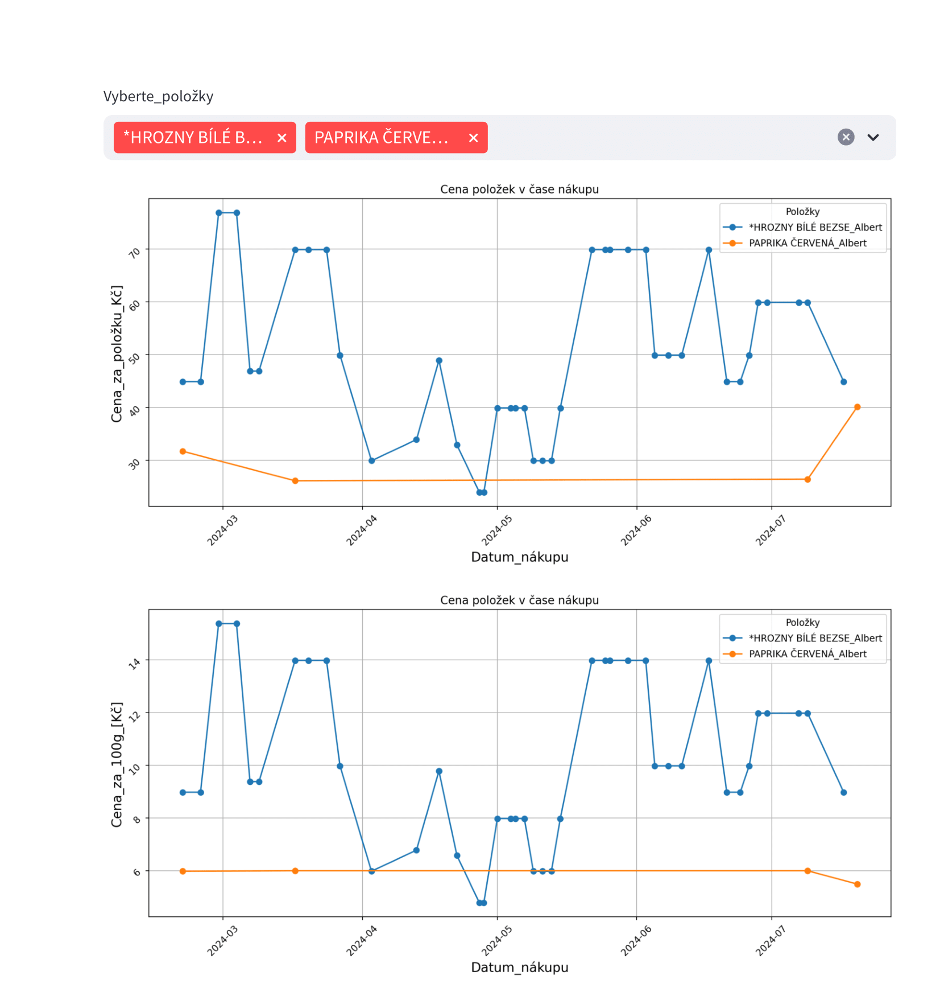
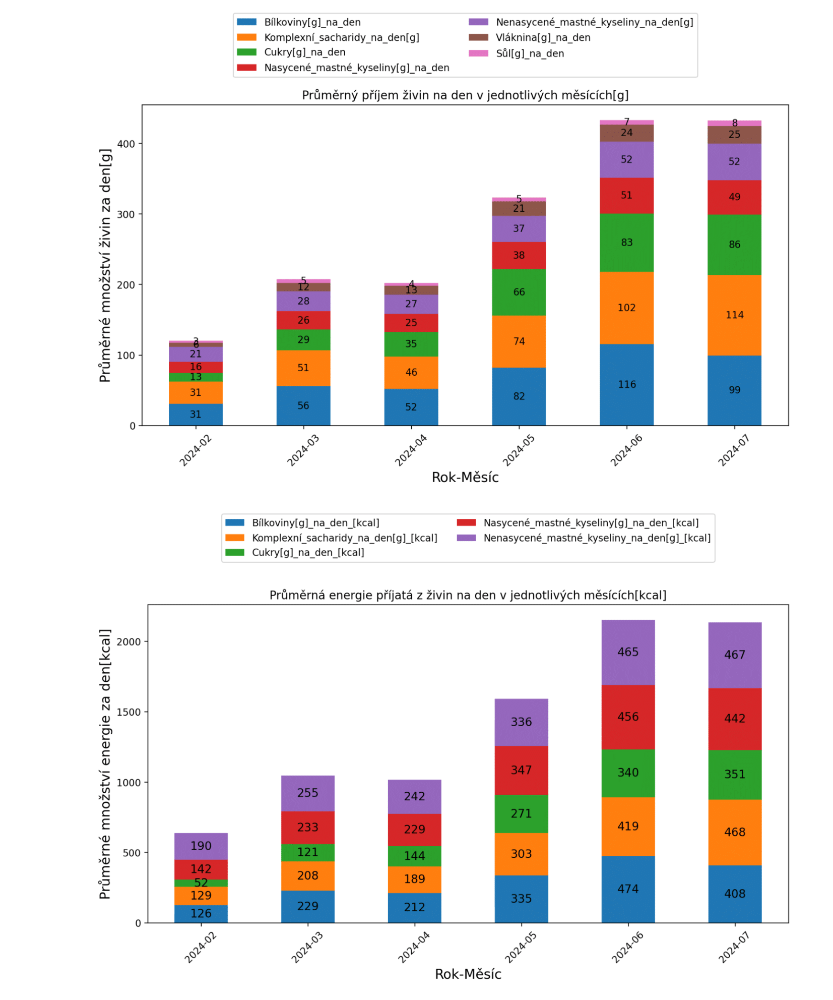
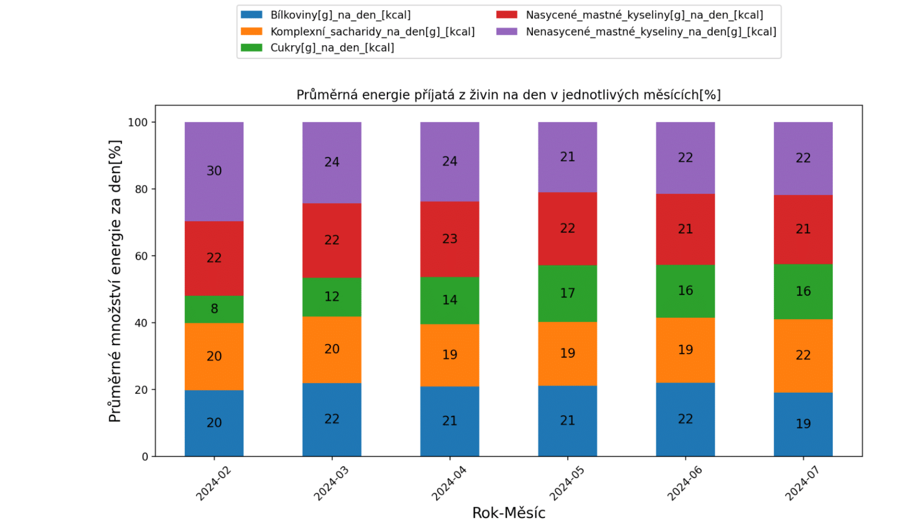
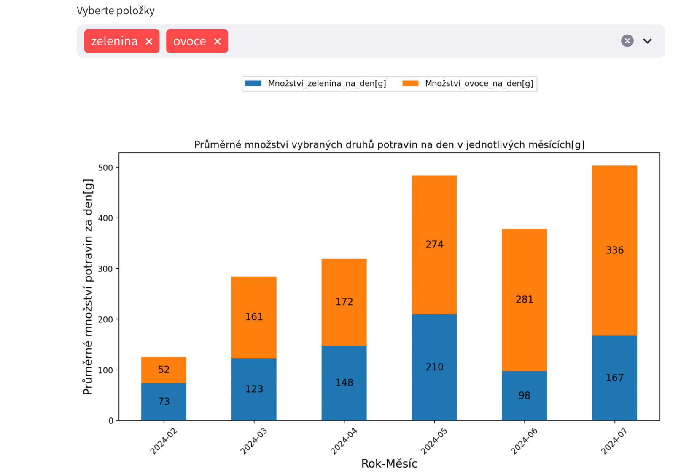
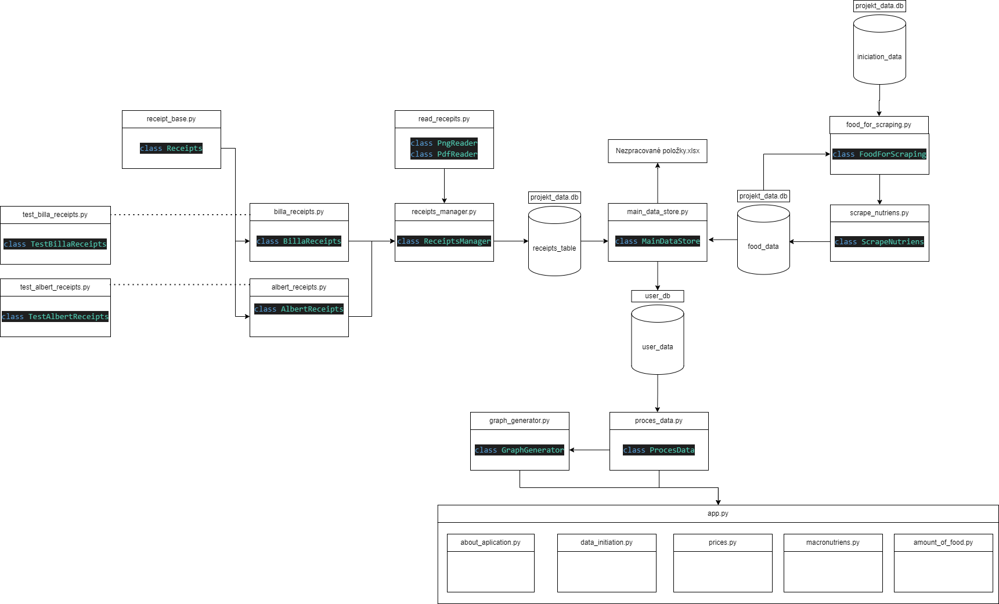

 # Vítejte v aplikaci ReceiptNutriTracker

 ## O aplikaci

Aplikace ReceiptNutriTracker je navržena tak, aby uživatelům pomohla sledovat dlouhodobé stravovací zvyklosti a cenovou hladinu zakoupených položek v supermarketech.
Umožňuje to automatické zpracování nahraných účtenek (aktuálně je podpora pro obchody Albert a Lidl).

Z každé účtenky aplikace extrahuje informace o zakoupených položkách, jejich množství, ceně a datu nákupu. K těmto položkám navíc scrapuje výživové hodnoty ze stránky www.kaloricketabulky.cz.

Aby nedocházelo k přílišnému vytěžování webu www.kaloricketabulky.cz, tak součástí této volně přístupné verze není možnost scrapování dat. Aplikace již obsahuje výživová data některých položek v databázi projekt_data.db. Položky z vašich účtenek, které nejsou v databázi se vygenerují do souboru "Nezpracované položky.xlsx" po zmáčknutí tlačítka "Zpracuj účtenky" v sekci aplikace "Zpracování účtenek". 

Pokud máte zájem o přidání položek do databáze, vyplňte soubor 'Nezpracované položky.xlsx' a zašlete ho na adresu receiptnutritracker@gmail.com. 
K zaslaným položkám scrapuji data a aktualizuji repozitář GitHubu tohoto projektu."

## Postup pro vyplnění souboru "Nezpracované položky.xlsx"
            
Soubor obsahuje 4 sloupce.             
V prvním sloupci je vygenerovaný název položky z účtenek, tento sloupec neměňte.           
Do druhého sloupce přidejte url odkaz na položku ze stránky "www.kaloricketabulky.cz"          
Do třetího sloupce přidejte velikost balení v gramech. Pokuď je velikost balení různorodá (např. u potravin, které jdou při nákupu na váhu), tak do kolonky napiště 1000.
Do čtvrtého sloupce vyberte a napište druh potraviny z tohoto výběru:
maso, masné výrobky, ryby, vejce, mléko a mléčné výrobky, obiloviny, ovoce, zelenina, průmyslově zpracované potraviny, ostatní

#### Příklad vyplněné tabulky:

| Položka                    | Odkaz                                                                              | Velikost_balení  | Druh_potraviny  |
| :-------------------------:| :---------------------------------------------------------------------------------:| :---------------:| :-------------: |
| PAPRIKA ČERVENÁ_Albert     | https://www.kaloricketabulky.cz/potraviny/paprika-cervena                          | 1000             |  zelenina       |
| MLYNÁŘSKÁ VEKA 400G_Albert | https://www.kaloricketabulky.cz/potraviny/mlynarska-zitna-veka-albertovo-pekarstvi | 400              |  obiloviny      |

## Co aplikace nabízí
### V sekci 'Ceny'

Zde vyberete libovolné položky, které vás zajímají.
První graf zobrazuje, kolik stála položka v čase nákupu.
Druhý graf zobrazuje cenu přepočtenou na 100g.
        
         

### V sekci 'Makroživiny' 

Zde naleznete 3 sloupcové grafy.           
První zobrazuje průměrné množství makroživin za den v gramech pro jednotlivé měsíce.            
Druhý zobrazuje průměrné množství makroživin za den v kcal pro jednotlivé měsíce.            
Třetí zobrazuje procentuální podíl příjmu energie z makroživin za den pro jednotlivé měsíce.

### V sekci 'Množství jídla' 
   
Zde vyberete libovolné položky, které vás zajímají.
Graf zobrazuje průměrné nakoupené množství vybraných druhů potravin na den v jednotlivých měsících v gramech.         

## Architektura

## Instalace

### Postup pro windows
Nejprve ověřte, zda máte nainstalovaný Git. Otevřete terminál a zadejte: `git --version`.
Pokud Git není nainstalován, stáhněte si jej z oficiálních stránek: https://git-scm.com/downloads
Git můžete nainstalovat do libovolného adresáře, ale je důležité zaškrtnout možnost: **Git from the command line and also from 3rd-party software**.

Nyní naklonujte repozitář projektu do svého počítače pomocí příkazu `git clone https://github.com/DavidProthon/ReceiptNutriTracker.git`. 
Přesuňte se do složky projektu "ReceiptNutriTracker" a vytvořte si zde virtuální prostředí příkazem `python -m venv venv` a aktivujte ho `venv\Scripts\activate`.

S aktivovaným virtuálním prostředím nainstalujte závislosti `pip install -r requirements.txt` 
Vytvořte složku **Tesseract-OCR** ve složce projektu příkazem `mkdir Tesseract-OCR`, do které nainstalujte Tesseract-OCR z https://github.com/UB-Mannheim/tesseract/wiki.
Stáhněte si jazykový datový soubor pro český jazyk **ces.traineddata** ze stránky https://github.com/tesseract-ocr/tessdata/blob/main/ces.traineddata
a vložte ho do složky `NutriTracker\Tesseract-OCR\tessdata`

Nakonec vytvořte složku "uctenky" ve složce projektu příkazem `mkdir uctenky` a vložte do ní účtenky, které chcete zpracovat (nechte si je vygenerovat v nákupních aplikacích).
Nyní můžete aplikaci spustit příkazem `streamlit run app.py`

## Licence

Tento projekt je licencován pod MIT licencí.
 
## Kontakt a pár slov na závěr

Aplikace je momentálně ve vývoji a může obsahovat chyby.
Pokuď na nějakou narazíte, nebo máte zájem o přidání nové funkcionality, napište na adresu receiptnutritracker@gmail.com, případně rovnou zašlete Pull Request.
Doufám, že se vám aplikace bude líbit a najdete pro ni využití.
Každý, kdo by se chtěl připojit k vývoji, je vítán.

S pozdravem,            
DavidProthon    
